# MediTrack PNG — Entity Relationship Diagram (ERD)

Derived from Laravel migrations in `database/migrations`, plus planned Modilon dispensing entities (`patients`, `dispensing_records`) aligned with project scope.

**Scope:** Domain + authentication tables used by MediTrack PNG.  
**Excluded (infrastructure only):** `cache`, `cache_locks`, `jobs`, `job_batches`, `failed_jobs`, `password_reset_tokens`, `sessions`.

---

## Domain overview

```text
NDoH procurement          Lae AMS logistics           Modilon hospital
─────────────────         ─────────────────           ────────────────
suppliers → medicines → orders → order_items
                ↓
              drugs (lots by level: ndoh | lae_ams | modilon_hospital)
                ↓
         stock_transfers ← vehicles
                ↕
         hospital_orders → discrepancy_reports
                ↓
         patients → dispensing_records → drugs (modilon lots)
```

Users connect via Spatie roles (`admin`, `procurement_officer`, `store_manager`, `pharmacy_manager`, `pharmacist`).

---

## Implementation status

| Entity | In migrations today | Notes |
|--------|---------------------|-------|
| users, roles, permissions, … | Yes | Live |
| suppliers, medicines, drugs, orders, order_items | Yes | Live |
| vehicles, stock_transfers, hospital_orders, discrepancy_reports | Yes | Live |
| notifications | Yes | Live |
| **patients** | **No** | Planned for pharmacist dispensing |
| **dispensing_records** | **No** | Referenced by `Drug::dispensingRecords()`; table not created yet |

---

## Mermaid ERD (canonical)

```mermaid
erDiagram
    direction LR

    users ||--o{ medicines : creates
    users ||--o{ drugs : records
    users ||--o{ orders : places_or_approves
    users ||--o{ hospital_orders : requests_or_reviews
    users ||--o{ stock_transfers : sends_or_receives
    users ||--o{ discrepancy_reports : reports_or_resolves
    users ||--o{ dispensing_records : dispenses
    users ||--o{ model_has_roles : assigned
    users ||--o{ notifications : receives

    roles ||--o{ model_has_roles : has
    roles ||--o{ role_has_permissions : grants
    permissions ||--o{ role_has_permissions : granted_by
    permissions ||--o{ model_has_permissions : assigned

    suppliers ||--o{ medicines : supplies
    suppliers ||--o{ orders : fulfills

    medicines ||--o{ drugs : catalogued_as
    medicines ||--o{ orders : referenced_by
    medicines ||--o{ order_items : line_catalog

    orders ||--|{ order_items : contains
    drugs ||--o{ order_items : optional_lot
    drugs ||--o{ orders : optional_header_lot

    drugs ||--o{ stock_transfers : sourced_from
    drugs ||--o{ stock_transfers : received_as
    drugs ||--o{ hospital_orders : fulfilled_from
    drugs ||--o{ dispensing_records : dispensed_from

    vehicles ||--o{ stock_transfers : hauls
    hospital_orders ||--o| stock_transfers : shipped_via
    hospital_orders ||--o{ discrepancy_reports : about
    stock_transfers ||--o{ discrepancy_reports : about

    patients ||--o{ dispensing_records : receives

    users {
        bigint id PK
        string name
        string email UK
        string phone
        string job_title
        string employee_id
        string facility
        string profile_photo_path
        string password
        datetime email_verified_at
    }

    roles {
        bigint id PK
        string name UK
        string guard_name
    }

    permissions {
        bigint id PK
        string name UK
        string guard_name
    }

    model_has_roles {
        bigint role_id PK, FK
        bigint model_id PK
        string model_type PK
    }

    model_has_permissions {
        bigint permission_id PK, FK
        bigint model_id PK
        string model_type PK
    }

    role_has_permissions {
        bigint permission_id PK, FK
        bigint role_id PK, FK
    }

    suppliers {
        bigint id PK
        string name
        string country
        string headquarters
        bool is_active
    }

    medicines {
        bigint id PK
        string name
        string dosage
        string dosage_form
        string unit
        text description
        bigint supplier_id FK
        int reorder_point
        bool is_active
        bigint created_by FK
        bigint updated_by FK
    }

    drugs {
        bigint id PK
        bigint medicine_id FK
        string drug_name
        string batch_number UK
        date expiry_date
        int quantity_received
        int quantity_on_hand
        int reorder_point
        string unit
        string level
        string status
        decimal cost_per_unit
        bigint created_by FK
        bigint updated_by FK
    }

    orders {
        bigint id PK
        string order_number UK
        bigint medicine_id FK
        bigint drug_id FK
        bigint supplier_id FK
        int quantity_ordered
        int quantity_received
        string status
        string source
        date order_date
        bigint created_by FK
        bigint approved_by FK
        bigint received_by FK
        datetime deleted_at
    }

    order_items {
        bigint id PK
        bigint order_id FK
        bigint medicine_id FK
        bigint drug_id FK
        int quantity_ordered
        int quantity_received
    }

    vehicles {
        bigint id PK
        string name
        string registration UK
        string type
        string depot
        bool is_active
    }

    hospital_orders {
        bigint id PK
        string order_number UK
        string drug_name
        string dosage
        int quantity_requested
        int quantity_approved
        bigint source_drug_id FK
        string status
        bigint requested_by FK
        bigint reviewed_by FK
        bigint stock_transfer_id FK
    }

    stock_transfers {
        bigint id PK
        string transfer_number UK
        bigint drug_id FK
        bigint destination_drug_id FK
        bigint hospital_order_id FK
        bigint vehicle_id FK
        string batch_number
        int quantity_sent
        string from_level
        string to_level
        string status
        date sent_date
        bigint sent_by FK
        bigint received_by FK
    }

    discrepancy_reports {
        bigint id PK
        string report_number UK
        bigint hospital_order_id FK
        bigint stock_transfer_id FK
        string issue_type
        int quantity_expected
        int quantity_received
        text description
        string status
        bigint reported_by FK
        bigint resolved_by FK
    }

    patients {
        bigint id PK
        string patient_number UK
        string first_name
        string last_name
        date date_of_birth
        string gender
        string phone
        string facility
        bool is_active
        datetime created_at
        datetime updated_at
    }

    dispensing_records {
        bigint id PK
        bigint patient_id FK
        bigint drug_id FK
        int quantity_dispensed
        string prescription_ref
        text notes
        bigint dispensed_by FK
        datetime dispensed_at
        datetime created_at
        datetime updated_at
    }

    notifications {
        uuid id PK
        string type
        string notifiable_type
        bigint notifiable_id
        text data
        datetime read_at
    }
```



---

## Cardinality summary

| Parent | Child | Cardinality | Notes |
|--------|-------|-------------|-------|
| users | roles | M:N | via `model_has_roles` (Spatie) |
| roles | permissions | M:N | via `role_has_permissions` |
| suppliers | medicines | 1:N | nullable FK |
| suppliers | orders | 1:N | nullable FK |
| medicines | drugs | 1:N | catalog → inventory lots |
| orders | order_items | 1:N | cascade delete |
| drugs | stock_transfers | 1:N | source lot (`drug_id`) |
| drugs | stock_transfers | 1:N | destination lot (`destination_drug_id`) |
| vehicles | stock_transfers | 1:N | nullable (road dispatch) |
| hospital_orders | stock_transfers | 0..1 : 0..1 | mutual optional FKs |
| hospital_orders | discrepancy_reports | 1:N | optional |
| stock_transfers | discrepancy_reports | 1:N | optional |
| patients | dispensing_records | 1:N | Modilon dispensing |
| drugs | dispensing_records | 1:N | usually `modilon_hospital` lots |
| users | dispensing_records | 1:N | pharmacist (`dispensed_by`) |
| users | notifications | 1:N | polymorphic |

---

## Key enums (business rules)

| Table | Column | Values |
|-------|--------|--------|
| suppliers | country | `india`, `china`, `png`, `international` |
| medicines / drugs | dosage_form | `tablet`, `injection`, `syrup`, `cream`, `ointment`, `other` |
| drugs | level | `ndoh`, `lae_ams`, `modilon_hospital` |
| drugs | status | `active`, `expired`, `written_off` |
| orders | status | `pending`, `manufacturing`, `shipped`, `customs`, `fx_cleared`, `received`, `partial`, `cancelled` |
| orders | source | `overseas`, `local`, `donation` |
| hospital_orders | status | `pending`, `approved`, `rejected`, `shipped`, `received`, `cancelled` |
| stock_transfers | status | `sent`, `received`, `cancelled` |
| discrepancy_reports | issue_type | `short_shipment`, `damaged`, `wrong_item`, `expired`, `other` |
| patients | gender | `male`, `female`, `other`, `unspecified` (planned) |

---

## Design notes

1. **`medicines`** = master catalog; **`drugs`** = physical batches / lots at a supply-chain level.  
2. **`orders` / `order_items`** = NDoH procurement (import pipeline).  
3. **`hospital_orders`** = Modilon requests against Lae AMS stock (no line-items table).  
4. **`stock_transfers`** = movement between levels (NDoH→Lae AMS, Lae AMS→Modilon), optionally with a **vehicle**.  
5. **`patients` / `dispensing_records`** = end of the chain at Modilon (pharmacist dispenses from hospital inventory).  
6. Soft deletes: `orders.deleted_at` only among live domain tables.

---

## How to use this ERD

- Paste the Mermaid block into [Mermaid Live](https://mermaid.live), GitHub Markdown, or your project report.  
- Keep this file updated when you add migrations (especially when implementing patients/dispensing).
